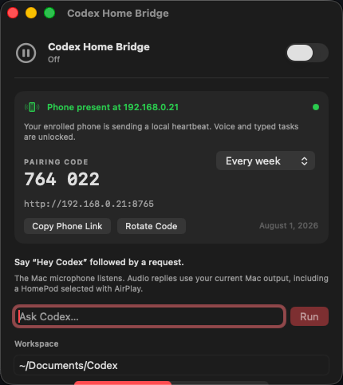

# Codex Home Bridge

An unofficial, open-source macOS menu-bar utility that turns a Mac and a HomePod into a voice interface for Codex.



The architecture is deliberately honest:

- Your Mac microphone captures the wake phrase and request.
- Apple Speech transcribes it, preferring on-device recognition when available.
- The local Codex CLI handles the request using your existing Codex sign-in.
- macOS speaks the response through the current audio output.
- If you select a HomePod in macOS Sound or AirPlay controls, the response plays there.
- A local iPhone heartbeat unlocks the listener only while your enrolled phone is present.

HomePod microphones are not exposed to third-party macOS apps as a general audio input. This project does not claim otherwise.

## Requirements

- macOS 14 or newer
- Swift 6 / Xcode 16 or newer
- The Codex desktop app or current Codex CLI
- A signed-in Codex account
- Optional: a HomePod or HomePod mini on the same Wi-Fi network

## Build

```bash
chmod +x scripts/build-app.sh scripts/install-local.sh
./scripts/build-app.sh
```

The unsigned development build is created at:

```text
dist/Codex Home Bridge.app
```

To copy it to `~/Applications` and open it:

```bash
./scripts/install-local.sh
```

The app is ad-hoc signed for local use. A public binary release should be Developer ID signed and notarized.

## Use

1. Open the app and allow microphone and speech-recognition access.
2. Select your HomePod under macOS Control Centre > Sound.
3. Turn listening on from the menu-bar window.
4. Open the phone link shown in the app, enter the six-digit code, and keep the page open.
5. Say: “Hey Codex, summarize the project in my Codex folder.”
6. Choose `Read only` for questions and inspection. Choose `Workspace write` only when you want Codex to edit files.

Typed requests are included so the app can be tested without granting microphone access.

## Phone-presence gate

The bridge hosts a tiny pairing page on your Mac at port `8765`. Your iPhone must be on the same local network, paired with the six-digit code shown on the Mac, and sending a heartbeat. If the heartbeat disappears for 18 seconds, both voice and typed tasks lock automatically.

- Pairing credentials can rotate every week or every month.
- Rotating the code immediately removes the previous phone credential.
- Five incorrect codes within one minute trigger a one-minute rate limit.
- The pairing page asks the phone to keep its screen awake when Safari permits it.

This is stricter and more dependable than scanning every IP address and guessing which one belongs to a phone. A same-Wi-Fi heartbeat proves local network presence, not precise physical distance. Background web pages can be suspended by iOS, so keep the pairing page open while the bridge is armed. A future native iOS companion could replace the open-page requirement with Bluetooth proximity and background networking.

## Privacy

- No OpenAI API key is stored by this app.
- The app reuses the local Codex CLI and its existing sign-in.
- Speech recognition prefers on-device processing when the selected locale supports it.
- On systems without on-device recognition support, Apple Speech may use Apple services.
- Spoken requests are passed to Codex. Codex permissions and data handling follow the account and local configuration used by the CLI.

## Security model

The default mode is `Read only`. The only write-enabled mode is scoped to the chosen workspace. The app does not expose `danger-full-access`.

Voice commands can be misheard. Review important or destructive work in the Codex app or terminal before allowing changes.

The phone gate reduces accidental or unattended activation, but it is not a substitute for macOS account security. The local pairing page is HTTP-only and should never be forwarded to the public internet.

## Project status

This is an MVP. It proves the practical Mac-microphone, Codex, and HomePod-output path. It does not provide:

- access to the HomePod microphone
- automatic AirPlay device selection
- a notarized installer
- a custom wake-word model
- multi-user voice recognition
- background Bluetooth proximity without a companion iOS app

The current `0.2.0` development build includes the working iPhone presence gate,
weekly or monthly credential rotation, pairing rate limits, and automatic
listener lockout when the phone heartbeat disappears.

The launch-page source is included in [`site/`](site/).

## License

MIT. See [LICENSE](LICENSE).

Codex, HomePod, macOS, and Apple are trademarks of their respective owners. This project is not affiliated with or endorsed by OpenAI or Apple.
